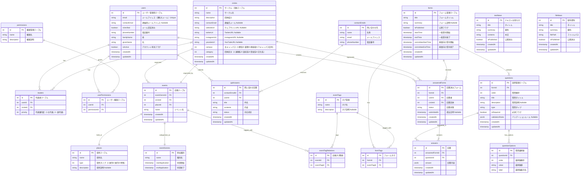

# ウェブポータル データベース設計

```mermaid
erDiagram 
    users ||--o{ leaders : has
    users ||--o{ userPermissions : has
    users ||--o{ answeredForms : creates
    users ||--o{ qaAnswers : submits
    
    circles }|--o{ leaders : has
    circles ||--o{ answeredForms : represents
    circles ||--o{ events : organizes
    
    permissions ||--o{ userPermissions : grants
    
    forms ||--|{ questions : contains
    forms ||--o{ answeredForms : receives
    forms ||--o{ formTags : has
    
    questions ||--o{ answers : answered_in
    questions ||--o{ questionOptions : has_options
    
    answeredForms ||--|{ answers : contains
    
    events ||--|| circles : organized_by
    events ||--o{ eventTagRelations : tagged_with
    events ||--|| eventGenres : categorized_as
    events ||--|| places : held_at
    
    eventTags ||--o{ formTags : tagged_with
    eventTags ||--o{ eventTagRelations : tags
    
    contactEmails ||--o{ qaAnswers : receives

    users {
        int id PK "ユーザー管理用テーブル"
        string email "メールアドレス（理科大メール）Unique"
        string contactEmail "連絡用メールアドレス Nullable"
        boolean isVerified "メール認証済み"
        string phoneNumber "電話番号"
        string familyName "姓"
        string givenName "名"
        boolean isActive "アカウント有効フラグ"
        timestamp createdAt
        timestamp updatedAt
    }

    circles {
        int id PK "サークル・団体テーブル"
        string name "サークル名"
        string description "団体紹介"
        string contactEmail "連絡先メール Nullable"
        string websiteUrl "ウェブサイトURL Nullable"
        string twitterUrl "TwitterURL Nullable"
        string instagramUrl "InstagramURL Nullable"
        string youtubeUrl "YouTubeURL Nullable"
        int campus "主キャンパス（1:野田/2:葛飾/3:神楽坂/4:３キャンパス合同）"
        int category "団体区分（1:運動系/2:演技系/3:音楽系/4:文化系）"
        timestamp createdAt
        timestamp updatedAt
    }

    leaders {
        int id PK "代表者テーブル"
        int userId FK
        int circleId FK
        int priority "代表優先度（1:主代表, 2~:副代表）"
    }

    permissions {
        int id PK "権限管理テーブル"
        string name "権限名"
        string description "権限説明"
    }

    userPermissions {
        int id PK "ユーザー権限テーブル"
        int userId FK
        int permissionId FK
    }

    forms {
        int id PK "フォーム管理テーブル"
        string title "フォームタイトル"
        string summary "フォーム説明 Nullable"
        boolean isPublished "公開フラグ"
        timestamp startTime "一般受付開始"
        timestamp endTime "一般受付終了"
        timestamp committeeStartTime "委員向け受付開始"
        timestamp committeeEndTime "委員向け受付終了"
        timestamp createdAt
        timestamp updatedAt
    }

    formTags {
        int id PK "フォームタグ"
        int formId FK
        int eventTagId FK
    }

    questions {
        int id PK "設問管理テーブル"
        int formId FK
        int order "質問順序"
        string title "質問タイトル"
        string description "質問説明 Nullable"
        string type "質問タイプ"
        boolean isRequired "必須フラグ"
        jsonb validationRules "バリデーションルール Nullable"
        timestamp createdAt
        timestamp updatedAt
    }

    questionOptions {
        int id PK "質問選択肢"
        int questionId FK
        int order "選択肢順序"
        string value "選択肢値"
        string label "選択肢表示名"
    }


    answeredForms {
        int id PK "回答済みフォーム"
        int formId FK
        int userId FK "回答者"
        int circleId FK "回答団体"
        string status "回答状態"
        timestamp submittedAt "提出日時 Nullable"
        timestamp createdAt
        timestamp updatedAt
    }

    answers {
        int id PK "回答"
        int answeredFormId FK
        int questionId FK
        jsonb answer "回答内容"
        timestamp createdAt
        timestamp updatedAt
    }

    textNews {
        int id PK "テキストお知らせ"
        string title "タイトル"
        string summary "要約"
        string contents "本文"
        boolean isPublished "公開済み"
        timestamp createdAt
        timestamp updatedAt
    }

    fileNews {
        int id PK "配布資料"
        string title "タイトル"
        string summary "要約"
        string filePath "ファイルパス"
        boolean isPublished "公開済み"
        timestamp createdAt
        timestamp updatedAt
    }

    events {
        int id PK "企画テーブル"
        int eventGenreId FK
        int circleId FK
        int placeId FK
        string name "イベント名"
        timestamp createdAt
        timestamp updatedAt
    }

    eventTagRelations {
        int id PK "企画タグ関係"
        int eventId FK
        int eventTagId FK
    }

    eventGenres {
        int id PK "参加種別"
        string name "種別名"
        timestamp startApplication "申請開始"
        timestamp endApplication "申請終了"
    }

    eventTags {
        int id PK "タグ管理"
        string name "タグ名"
        string description "タグ説明 Nullable"
    }

    places {
        int id PK "場所テーブル"
        string name "場所名"
        int type "場所タイプ（1:屋外/2:屋内/3:特殊）"
        string description "場所説明 Nullable"
    }

    contactEmails {
        int id PK "問い合わせ先"
        string name "名称"
        string email "メールアドレス"
        string phoneNumber "電話番号"
    }

    qaAnswers {
        int id PK "問い合わせ回答"
        int contactEmailId FK
        int userId FK
        string title "件名"
        string contents "内容"
        string status "対応状況"
        timestamp createdAt
        timestamp updatedAt
    }
```